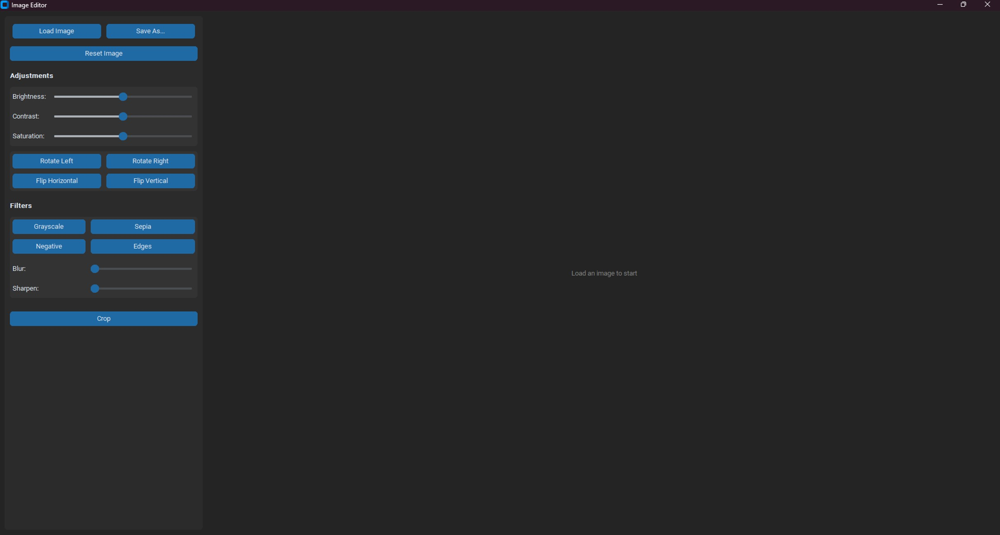

# Image Editor - Manual Kernels & CustomTkinter GUI

A user-friendly desktop Image Editor application built with Python, `customtkinter`, and `Pillow`. This tool allows for various image adjustments and filter applications. A key feature is the manual implementation of convolution kernels for filters like blur, sharpen, and edge detection, offering a look into the underlying mechanics of image processing.



## Features

*   **Image Loading & Saving:**
    *   Load images using a file dialog.
    *   Save processed images to any path with various formats (e.g., PNG, JPG, BMP - supported by Pillow).
*   **Adjustments:**
    *   Brightness
    *   Contrast
    *   Saturation
*   **Transformations:**
    *   Rotate Left
    *   Rotate Right
    *   Flip Horizontal
    *   Flip Vertical
*   **Filters (with manual kernel/implementation for several):**
    *   Grayscale
    *   Sepia
    *   Negative (Invert Colors)
    *   Blur (Gaussian blur using a manually generated kernel and convolution)
    *   Sharpen (Sharpening filter using a manually applied kernel)
    *   Edges (Edge detection using a manually applied kernel)
*   **Cropping:** Interactively select and crop a region of the image.
*   **Reset:** Revert all changes back to the originally loaded image.

## Technologies & Libraries Used

*   **Python 3.7+** (Developed and tested with Python 3.11.9)
*   **CustomTkinter (`customtkinter==5.2.2`):** For creating the modern graphical user interface.
*   **Pillow (`pillow==11.2.1`):** For image loading, saving, and basic manipulations.
*   **NumPy (`numpy==2.2.6`):** For numerical operations, manual kernel implementations, and pixel manipulations.
*   **Darkdetect (`darkdetect==0.8.0`):** Dependency for system theme detection (often used by CustomTkinter).
*   **Packaging (`packaging==25.0`):** Dependency for version handling and other packaging utilities.

## Setup

1.  **Ensure Python 3.7 or newer is installed.** (This project was developed with Python 3.11.9).
    You can download Python from [python.org](https://www.python.org/).
2.  **Clone the repository:**
    ```bash
    git clone https://github.com/metinkibaroglu/image-editor-manual.git
    cd image-editor-manual
    ```
3.  **Create and activate a virtual environment (recommended):**
    ```bash
    # For Windows
    python -m venv venv
    .\venv\Scripts\activate
    
    # For macOS/Linux
    python3 -m venv venv
    source venv/bin/activate
    ```
4.  **Install required libraries using `requirements.txt`:**
    ```bash
    pip install -r requirements.txt
    ```

## Usage

1.  Navigate to the project directory in your terminal.
2.  Run the application:
    ```bash
    python image_editor.py
    ```
3.  Use the GUI to load an image, apply edits, and save your work.

## How It Works: Manual Implementations

This project emphasizes understanding fundamental image processing techniques:

*   **Manual Convolution for Filters:** Filters like Gaussian Blur, Sharpen, and Edge Detection are not simply calls to a library's pre-built filter functions. Instead:
    1.  **Kernel Definition:** Specific kernels (small matrices) for these effects are defined or generated (e.g., Gaussian kernel).
    2.  **Convolution Logic:** The `_manual_convolve` function (using `numpy.lib.stride_tricks.as_strided` and `np.einsum` for efficiency) performs the 2D convolution operation across image channels. This involves sliding the kernel over the image and calculating weighted sums of pixel neighborhoods.
*   **Manual Adjustments:** Brightness, contrast, and saturation are also adjusted by directly manipulating pixel values using NumPy arrays, rather than solely relying on Pillow's enhancement module for these specific operations.

This approach provides insight into how these common image editing operations work at a lower level.

## Available Operations (via GUI)

*   **Load Image:** Opens a dialog to select an image file.
*   **Save As...:** Opens a dialog to save the current image.
*   **Reset Image:** Restores the image to its state when it was first loaded.
*   **Adjustments (Sliders):**
    *   **Brightness:** Modifies image brightness.
    *   **Contrast:** Modifies image contrast.
    *   **Saturation:** Modifies image saturation.
*   **Transformations (Buttons):**
    *   **Rotate Left/Right:** Rotates the image by 90 degrees.
    *   **Flip Horizontal/Vertical:** Flips the image.
*   **Filters (Buttons & Sliders where applicable):**
    *   **Grayscale:** Converts the image to grayscale.
    *   **Sepia:** Applies a sepia tone.
    *   **Negative:** Inverts image colors.
    *   **Edges:** Applies an edge detection filter (manual kernel).
    *   **Blur (Slider):** Applies Gaussian blur (manual kernel); intensity controlled by the slider.
    *   **Sharpen (Slider):** Applies a sharpening filter (manual kernel); intensity controlled by the slider.
*   **Crop (Button):** Enables a cropping mode to select an area. Click again to apply the crop.

## To-Do / Future Enhancements

*   [ ] More sophisticated kernel generation options.
*   [ ] Add more filter types (e.g., median filter, custom convolution kernel input).
*   [ ] Implement undo/redo functionality.
*   [ ] Display image metadata.
*   [ ] Performance optimization for very large images.
